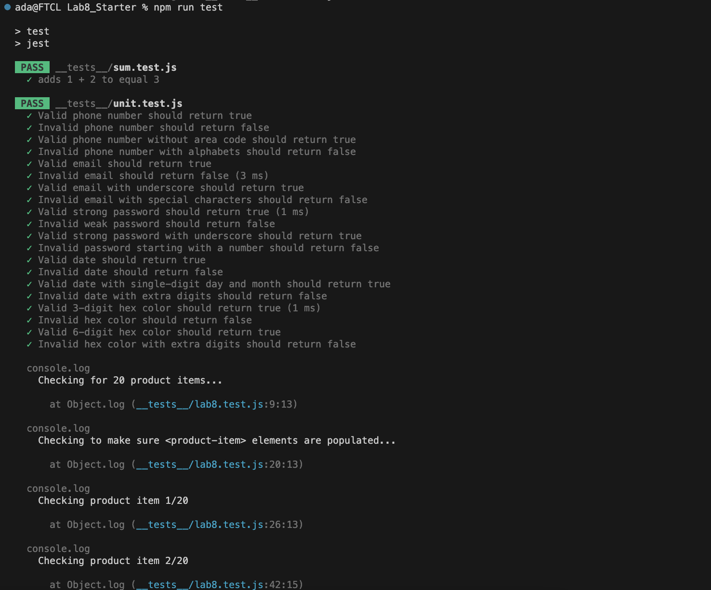
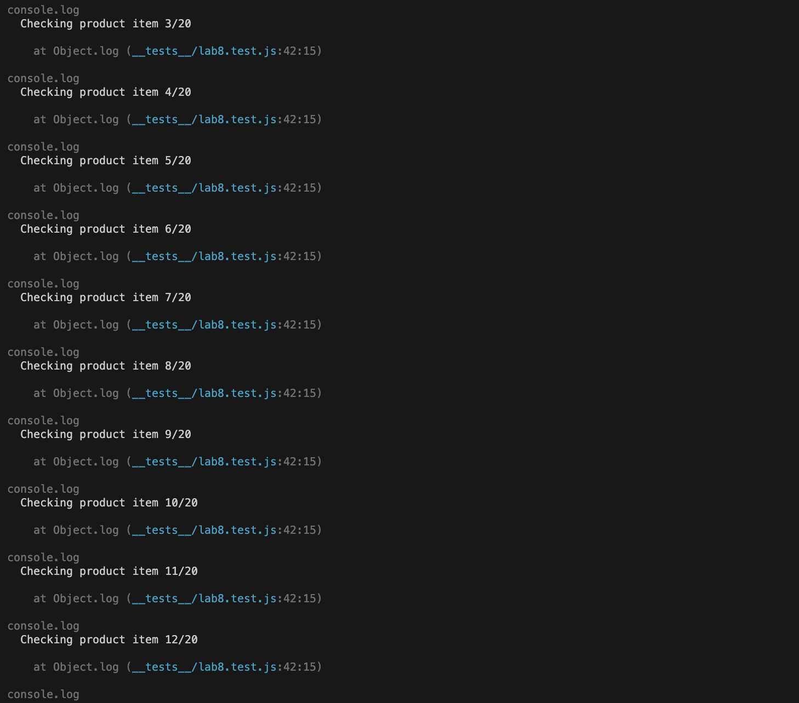
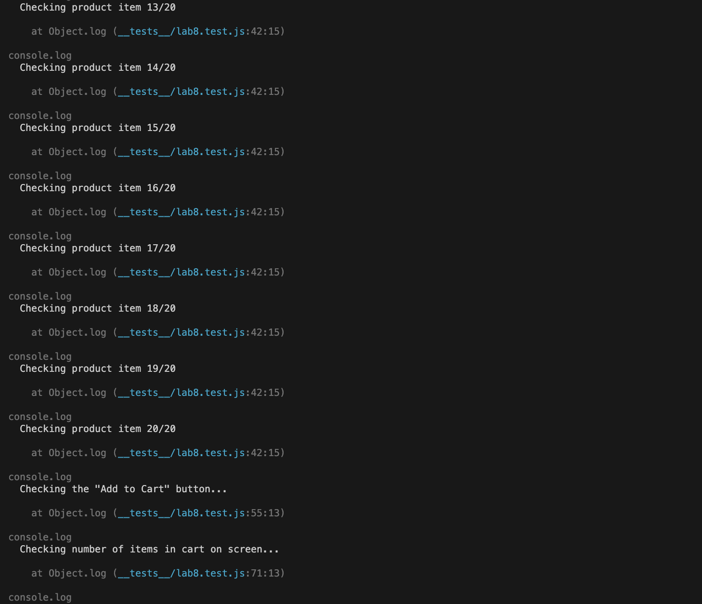
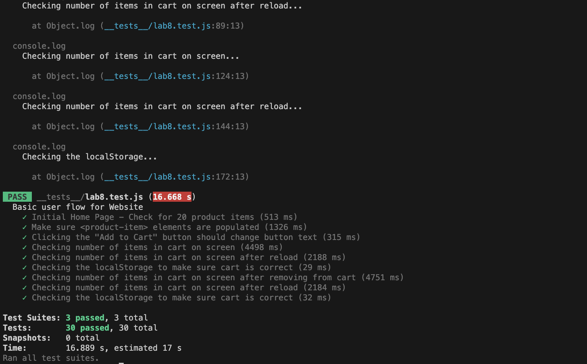

# Lab 8 - Starter
## Check Your Understanding question answers
1. In my opinion, the automated tests in the Recipe project development pipeline should be integrated within a GitHub action that runs whenever code is pushed. This approach allows for immediate feedback on any issues or bugs introduced by code changes. By automatically running the tests in a CI/CD environment like GitHub actions, we can ensure continuous integration and catch any problems early in the development process.

2. No, it wouldn't be appropriate to use an end-to-end test to check if a function is returning the correct output. End-to-end tests are more focused on verifying the overall behavior and interaction between different components of an application. Instead, we should use unit tests, which are specifically designed to test individual units of code, like functions, and are better suited for checking the correctness of function outputs.

3. I would refrain from using a unit test to test the "message" feature of a messaging application. The "message" feature involves user interaction, network communication, and potential dependencies on other components. To ensure proper testing of this feature, it would be more appropriate to use integration tests or end-to-end tests. These tests can simulate user actions and interactions with the entire messaging system, providing more comprehensive coverage.

4. Yes, a unit test would be suitable for testing the "max message length" feature of a messaging application. The "max message length" feature is typically a specific behavior of a single function or component. It can be effectively tested in isolation without relying on other parts of the system. By providing input messages of varying lengths, we can verify whether the function correctly enforces the maximum length constraint and returns the expected results.

## Screenshots of test results

